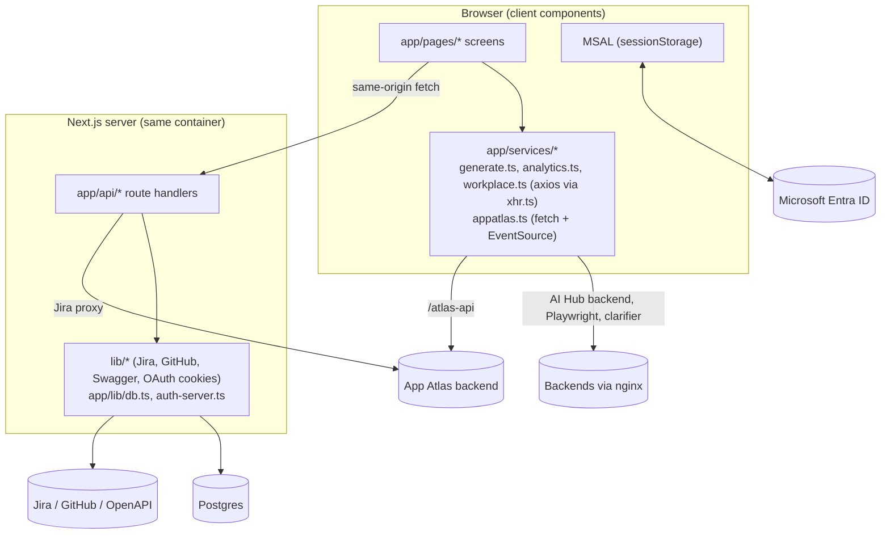
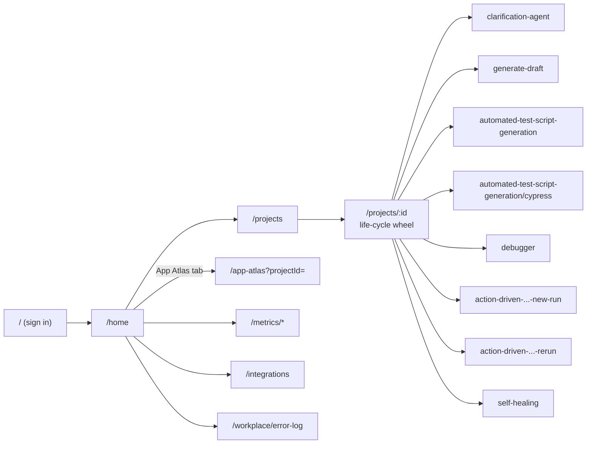
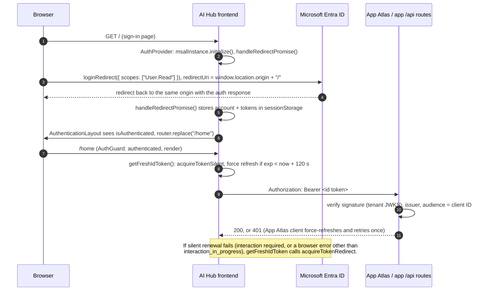

# Architecture

How the AI Hub frontend is put together: routes, state and data flow, Microsoft sign-in, the App Atlas workspace,
per-environment configuration, error handling, and the main design choices. For endpoint details see
[ENDPOINTS.md](ENDPOINTS.md); for settings see [CONFIGURATION.md](CONFIGURATION.md).

**Contents:** [Big picture](#big-picture) · [Route map](#route-map) · [Layouts and providers](#layouts-and-providers) ·
[State and data flow](#state-and-data-flow) · [Authentication (MSAL) flow](#authentication-msal-flow) ·
[App Atlas](#app-atlas) · [Integrations](#integrations) · [Configuration per environment](#configuration-per-environment) ·
[Error handling](#error-handling) · [Key design choices](#key-design-choices) · [Known gaps](#known-gaps)

---

## Big picture



- Every screen is a **client component** (`"use client"`). There are no server components that fetch data and no
  server actions. The server side is limited to the route handlers in `app/api/`.
- The browser calls the AI Hub backend, the Playwright codegen service, the clarification agent and the App Atlas
  backend **directly**, through the site's nginx.
- The Next.js server handles only what needs secrets or a database connection: Postgres, third-party credentials
  stored in httpOnly cookies, and the App Atlas Jira proxy.

---

## Route map

Folders under `app/pages/` are served at "pretty" URLs through `next.config.js` (rewrites `/x` → `/pages/x`,
redirects `/pages/x` → `/x`). The full table with files is in [ENDPOINTS.md § Pages](ENDPOINTS.md#7-pages-served-by-this-app).



- **Side navigation** comes from `app/constants/nav-items.ts`: Home, Workplace (Workplace Setup, Error Log, User
  Management), Domain, Projects, Metrics (three dashboards), Integrations, Resources, Billing Management (three pages),
  Settings and Customer Support. App Atlas is **not** in the side nav; it's opened from the Home page's "App Atlas"
  project tab, which links to `/app-atlas?projectId=<id>`.
- **Accelerators** are defined in `ACCELERATORS_LIFE_CYCLE` (`app/constants/projects.ts`), grouped by test life-cycle
  stage: Requirement analysis, Test Plan (empty), Test Case Development, Test Environment Setup, Test Execution and
  Test Closure (empty). Each entry has a `route` under `/projects/` and the wheel passes `projectId`, `workplace` and
  `domain` as query parameters.

---

## Layouts and providers

```
app/layout.tsx                RootLayout
└── AuthProvider              app/lib/provider.tsx: MSAL init + handleRedirectPromise, then <MsalProvider>
    ├── SitePresence          app/lib/site-presence.tsx: heartbeat to App Atlas /presence (renders nothing)
    ├── ToastProvider         react-toastify
    └── children
        ├── app/page.tsx      Sign-in (AuthenticationLayout → Login)
        └── app/pages/layout.tsx
            └── ProjectsProvider    app/lib/projectsStore.tsx
                ├── SideNav, TopNav  (App Atlas: icon rail only, no TopNav, full height)
                └── page            (most pages wrap themselves in <AuthGuard>)
```

- `AuthProvider` renders **nothing** until MSAL has initialised and processed any redirect response, so no page runs
  with a half-ready MSAL instance.
- `app/pages/layout.tsx` remembers whether the side nav is collapsed (`localStorage["sidenav-collapsed"]`). On
  `/app-atlas` it forces the narrow icon rail and drops the top nav to make room for the canvas.
- `/metrics/*` has its own layout (`app/pages/metrics/layout.tsx`) with tabs and a shared time filter
  (`MetricsFilterProvider`, `app/context/metrics-filter-context.tsx`).

---

## State and data flow

There is no global state library. State is React state plus a few contexts:

| State | Where | Scope |
|---|---|---|
| Signed-in account and tokens | MSAL (`msalInstance`, cached in **sessionStorage**) | Browser tab |
| Projects list and CRUD | `ProjectsProvider` / `useProjects()` (`app/lib/projectsStore.tsx`), loaded once from `GET /api/projects` and updated optimistically after POST, PATCH and DELETE | All signed-in pages |
| Integration status | `useIntegrationStatus()` (`app/hooks/use-integration-status.ts`): merges cookie-based status routes with the database rows | Per component that uses it |
| AI model state | `useModelStatus()` polls the clarifier's `model-status` (10 s while starting, 30 s otherwise) | Home |
| Metrics time window | `MetricsFilterProvider` | `/metrics/*` |
| Accelerator page state | Local `useState` in each page (uploaded file, results, loading flags) | Page |
| App Atlas session and canvases | Local state in `AtlasWorkspace`; active session id in `localStorage["appatlas-active-session"]`; viewer choice in `localStorage["appatlas-viewer"]` | `/app-atlas` |
| Sidebar collapsed | `localStorage["sidenav-collapsed"]` | Browser |

Typical flows:

- **Accelerator pages** (generate-draft, debugger, script generation, self-healing, action-driven): the page reads
  `projectId`, `workplace` and `domain` from the query string, looks the project up in `useProjects()`, and calls a
  function in `app/services/generate.ts`. Those go through `xhr.ts` (axios) to `BASE_URL`, i.e. the AI Hub backend or
  the Playwright service depending on the path.
- **Long-running work** is handled in three ways:
  - **Streaming:** Self Healing reads a `text/event-stream` body from `fetch` line by line.
  - **External tab:** action-driven recording opens the noVNC page in a new tab and polls `window.closed` every
    500 ms (`openExternalTabAndWait`); when the tab closes it stops the session and opens the save modal.
  - **Server-sent events:** App Atlas recording uses an `EventSource`.
- **Projects** live in the app's own Postgres table, so the Home page, the project wheel and App Atlas (which needs
  the project's **Application URL**) all read the same list.

---

## Authentication (MSAL) flow



Details:

- **Configuration** (`app/lib/msal.ts`): `clientId` from `NEXT_PUBLIC_MICROSOFT_ENTRA_CLIENT_ID`; authority
  `https://login.microsoftonline.com/<tenant>`, or `/common` if no tenant is set; `redirectUri` = the page origin in
  the browser (the `NEXT_PUBLIC_MICROSOFT_ENTRA_AD_REDIRECT_URI` value is only used while rendering on the server);
  `cacheLocation: "sessionStorage"`.
- **Which token is sent:** the **ID token**, not the access token. The only scope requested is `User.Read`
  (Microsoft Graph). Graph access tokens are meant for Graph and can't be validated by our own services, whereas the ID
  token's audience is our client ID, so App Atlas and `app/lib/auth-server.ts` can verify it.
- **Redirect, not popup:** `auth-client.ts` re-authenticates with `acquireTokenRedirect`, because popups fail with
  Edge's "Connected to Windows" account picker.
- **Guarding pages:** `AuthGuard` waits until MSAL is idle (`InteractionStatus.None`), then `router.replace("/")` if
  nobody is signed in. This is a client-side guard; the real protection is that the APIs check tokens.
- **Broken cache recovery:** if MSAL init throws, `AuthProvider` deletes `msal*` keys from sessionStorage and renders
  anyway, so the user lands on a working sign-in page.
- **Sign-out:** "Logout" in the top nav (`app/components/topnav.tsx`) calls `instance.logoutRedirect()`. The top nav
  isn't shown on `/app-atlas`. Closing the tab also ends the session, because the cache is in sessionStorage.

---

## App Atlas

App Atlas maps an application by recording a real user journey. The frontend part is `app/pages/app-atlas/page.tsx`
→ `AtlasWorkspace` (`app/components/app-atlas/atlas-workspace.tsx`). All backend calls go through `atlasClient()`
(`app/services/appatlas.ts`).

### Layout of the workspace

- **Header:** project picker (projects from `useProjects()`; the selected one is in `?projectId=`), tabs (**Canvas**;
  API Testing, SIT, Coverage, Security and Performance are "coming soon"), a History / My History toggle, and the
  avatars of people on the same project right now.
- **Explorer** (`explorer.tsx`): canvases recorded against the selected project's host (`hostOf(applicationUrl)`),
  with run, save, rename, delete and connect actions.
- **Main area**, in priority order: the live recording if one is running, else the selected canvas, else an empty
  state (for example "Save it to turn it into a canvas", or "has no Application URL yet").

### Live session (recording)

```mermaid
sequenceDiagram
  autonumber
  participant W as AtlasWorkspace
  participant R as RecordingView
  participant AA as App Atlas API

  W->>AA: POST /sessions { url: project.applicationUrl, devicePreset: "desktop", networkPreset: "none", viewer }
  AA-->>W: SessionSnapshot (status starting, viewer { kind, url })
  W->>W: localStorage["appatlas-active-session"] = id
  W->>R: render RecordingView
  R->>AA: EventSource /sessions/:id/events?access_token=...
  AA-->>R: event "snapshot" (repeated; keep the highest revision)
  R->>R: iframe = atlasUrl(viewer.url) (neko WebRTC or noVNC), sidebar = captured screens
  alt user clicks Finish & Save
    R->>AA: POST /sessions/:id/finish
    AA-->>R: final snapshot
    R->>W: onFinished(snap): open the Save modal
    W->>AA: POST /canvases { sessionId, name, description }
    AA-->>W: Canvas (selected and shown)
  else user clicks Discard
    R->>AA: DELETE /sessions/:id
  else the session times out or fails
    AA-->>R: snapshot with status expired or error, then the stream closes
  end
```

- **Starting** needs the project's **Application URL**. The viewer preference is `"vnc"` if the user switched to the
  compatible viewer before, otherwise `"auto"` (neko first).
- **Viewer switch:** "Switch to the compatible viewer" discards the session and starts a new one with `viewer: "vnc"`.
  "Try the smooth viewer" switches back. The iframe keeps the remote screen's aspect ratio (neko 16:9, noVNC 16:10).
- **Countdown:** `expiresAt` drives an "auto-stops in m:ss" timer; it turns red in the last minute.
- **Reload safety:** the active session id is kept in localStorage. After a reload the workspace calls
  `GET /sessions/:id`; if the session is still live it re-attaches, and if it stopped with screens it offers to save
  it. A `beforeunload` prompt warns before leaving mid-recording.
- **URL rewriting:** viewer and screenshot URLs from the backend may be relative or absolute on the prod host.
  `atlasUrl()` rewrites them onto the current site's `/atlas-api`, so dev and SIT don't load assets from prod.

### Canvas

`CanvasFlow` (`canvas-flow.tsx`) draws the saved canvas with `@xyflow/react`:

- **Nodes** are screens (`ScreenNode` in `screen-node.tsx`), showing the loaded-state screenshot, the path and
  page-object counts.
- **Edges** are navigations: dotted for links, solid for buttons, forms and everything else. Colours and filters come
  from the `Legend` component.
- **Layout** is computed in the client: breadth-first from the first screen, one column per depth, each column
  centred vertically.
- `editable` is true only for the owner's canvases (`canvas.isMine`); other people's canvases are labelled
  "view only". Rename and delete are also owner-only on the backend.

### Jira panel and mapping

1. **Connect:** the "Connect apps" modal (`connect-apps-modal.tsx`) shows Jira as available only if the user has
   connected Jira on `/integrations` (`useIntegrationStatus`). Linear, Teams and Slack are shown but disabled.
2. **Choose a project:** `GET /api/app-atlas/jira/projects` (this app's route) lists Jira projects using the user's
   own Jira credentials from cookies.
3. **Map:** `POST /api/app-atlas/canvases/:id/jira { projectKey }` → this app adds the Jira credentials and forwards
   to App Atlas, which fetches the tickets, scores them against each screen, and returns the updated `Canvas` with a
   `jira` mapping. This can take up to a minute on big projects. "Disconnect" calls the DELETE variant; "Re-map"
   repeats the POST.
4. **View:** clicking a screen opens `JiraPanel` (`jira-panel.tsx`). It lists the tickets App Atlas mapped to that
   node (`canvas.jira.nodes[nodeId]`), adds each ticket's epic (walking up to 4 parent levels), and groups them into
   Epic, Story, Bug and Task filter buttons. Each card links to Jira and shows status, assignee initials, priority and
   epic.
5. **Clarification questions:** after mapping, App Atlas generates requirement-clarification questions per ticket in
   the background. While any item is `queued` or `running`, the workspace polls
   `GET /canvases/:id/clarifications` every 5 s and merges the result into the open canvas. Each ticket card shows a
   spinner, an error, "No open questions", or the numbered questions with reasons. A ticket that has questions
   also has a Notes box: the canvas owner edits it (saved on blur, this canvas only, never sent to Jira); everyone
   else sees it read-only. `PUT /canvases/:id/notes/:issueKey` `{ text }`.

Manual mapping edits, Jira refresh and question retry/regenerate were removed from this app in the latest commits;
they are managed from the operations (logs) dashboard in appatlas-backend. `retryClarifications` and the `regenerate`
flag of `connectJira` remain in the client but aren't used by the UI.

### Presence

- **Project room:** the workspace sends `POST /presence { room: "app-atlas:<projectId>" }` every 15 s and
  `{ leaving: true }` on unmount, and shows up to three avatars plus a "+N" bubble.
- **Site-wide:** `SitePresence` sends `{ room: "ai-hub", page: <pathname> }` every 15 s while the tab is visible, using
  a silent token only, so the logs dashboard shows who has the AI Hub open and on which page.

---

## Integrations

`/integrations` lets each user connect Jira, GitHub or a Swagger/OpenAPI spec. There are two layers of state:

| Layer | Stored in | Holds | Used for |
|---|---|---|---|
| Credentials | httpOnly cookies on this site, set by `/api/auth/<provider>/connect` (or the OAuth callbacks) | Jira API token + email + site, or the Jira OAuth refresh token + cloud ID; GitHub token; Swagger URL + optional token | Server-side calls (Jira project list, App Atlas mapping) |
| Record | Postgres `user_integrations` (one row per user and provider), through `/api/integrations` | Provider, non-secret `meta` (labels, URLs), connected time | Showing "connected" across devices |

The UI's connect modal uses **API tokens / personal access tokens**. The OAuth authorize and callback routes for Jira
and GitHub exist and work when their environment variables are set, but nothing in the UI links to them today.

---

## Configuration per environment

| | Prod | SIT | Dev | Localhost |
|---|---|---|---|---|
| URL | ai-hub.protestcorp.com | ai-hub-sit.protestcorp.com | ai-hub-dev.protestcorp.com | localhost:3000 |
| Branch | `main` | `dev` (until a `sit` branch exists) | `dev` | any |
| Build env | `.env.production` for prod, on the VM | `.env.production` for SIT, on the VM | `.env.production` for dev, on the VM | `.env.local` |
| API bases in the browser | page origin | page origin | page origin | `NEXT_PUBLIC_*` values |
| Entra redirect URI | page origin + `/` | page origin + `/` | page origin + `/` | `http://localhost:3000/` |
| App Atlas | not in the current prod build | shared App Atlas backend | shared App Atlas backend | whatever `NEXT_PUBLIC_APPATLAS_API` points at |
| Postgres database (VM guide) | `aihub` | `aihub_nonprod` | `aihub_nonprod` | your own |

How this works in code:

- `siteOrigin()` (`app/config/urls.ts`) returns `window.location.origin` when the hostname matches
  `^ai-hub(-sit|-dev)?\.protestcorp\.com$`, and `undefined` otherwise. The AI Hub backend, Playwright, clarifier and
  App Atlas bases all prefer it. Because of this, each site calls **its own** backends whatever the build settings
  say, and pointing a build at the wrong backend can't make dev call prod.
- `NEXT_PUBLIC_*` values are compiled in by `next build`. That's why `aihub-deploy` builds one image per environment
  even when promoting the same commit.
- Server-only variables (`DATABASE_URL`, `JIRA_*`, `GITHUB_*`, `APPATLAS_API_INTERNAL`) are read when the server
  runs, from the environment file the container is started with (and from any `.env.production` present at build
  time).

The full list is in [CONFIGURATION.md](CONFIGURATION.md).

---

## Error handling

| Where | Behaviour |
|---|---|
| AI Hub backend calls (`xhr.ts`) | Rejects with `error.response` (the axios response, which can be `undefined` on network errors). Most pages `console.log` the error and stop the spinner; some show a toast (for example the rerun table). 401 is not handled specially. |
| App Atlas client | Throws `AtlasError(message, status)` using the backend's `{ error }` message. One automatic retry on 401 with a force-refreshed token. The workspace shows errors in a dismissible yellow notice bar; a 404 on a canvas shows "That canvas was deleted" and reloads the list. Polling and presence errors are ignored. |
| Recording stream | Snapshots with a lower `revision` are dropped. `finished`, `expired` and `error` close the stream; `error` shows "Recording failed: ...", and an empty recording shows "Nothing was recorded." |
| Clarification agent page | Non-JSON responses become "Backend returned HTTP <status> with an invalid response."; error bodies use `message`, `error` or `details`. |
| Route handlers | Return JSON `{ error }` with a meaningful status: 400 for bad input, 401 for a bad Entra token or rejected Jira credentials, 404 for a missing project, 409 when Jira isn't connected, 500 for database errors, 502 when Jira or App Atlas fails. The OAuth callbacks redirect to `/integrations?error=<code>` instead. |
| MSAL | Init errors clear the MSAL cache. Silent token failures fall back to a redirect sign-in (unless an interaction is already in progress). The presence heartbeat never triggers a redirect. |
| UI | Toasts come from `react-toastify` (`app/lib/toastify.tsx`). |

---

## Key design choices

1. **Call backends from the browser through the site's nginx, using the page origin.** One codebase serves prod, SIT
   and dev, and each site automatically talks to its own containers. The cost: the browser can reach every backend
   path, so backends must do their own auth (the AI Hub backend currently gets no token).
2. **Keep third-party secrets on the server.** Jira, GitHub and Swagger credentials live in httpOnly cookies and are
   used only by route handlers. App Atlas Jira mapping is proxied through `/api/app-atlas/canvases/:id/jira` so the
   browser never sees the Jira token; the proxy forwards the user's Entra token and `Origin` so App Atlas knows the user
   and the environment.
3. **Send the Entra ID token, verify it with `jose`.** No separate session system: the same ID token authenticates the
   user to App Atlas and to this app's API routes.
4. **Redirect-based MSAL with sessionStorage.** This works with Edge's account picker and doesn't keep tokens after the
   tab closes. The redirect URI follows the page origin, so one app registration covers every site.
5. **Pretty URLs over `app/pages/`.** Screens live in a `pages` folder (an App Router folder, not the old Pages
   Router) and are exposed with rewrites, so URLs stay short (`/projects/...`) and `/pages/...` links redirect.
6. **Server-sent events for live App Atlas data.** One-way snapshots with a `revision` number are simpler than
   WebSockets and survive proxies. The token goes in the query string because `EventSource` can't send headers.
7. **The App Atlas contract is copied, not shared.** `app/interfaces/appatlas.ts` is a copy of the backend's types and
   must be kept in sync by hand.
8. **Webpack for production builds.** `next build --webpack` opts out of Turbopack, the Next.js 16 default.

---

## Known gaps

These are visible in the code and worth knowing before changing things:

- `npm run lint` uses `next lint`, which Next.js 16 removed.
- In the accelerator wheel the labels "Selenium" and "cypress" are swapped relative to the routes they open
  (`app/constants/projects.ts`).
- `Dockerfile` ends with `COPY /app .`, a leftover from an earlier multi-stage build that copies the `app/` folder
  over the working directory again; it's harmless but confusing.
